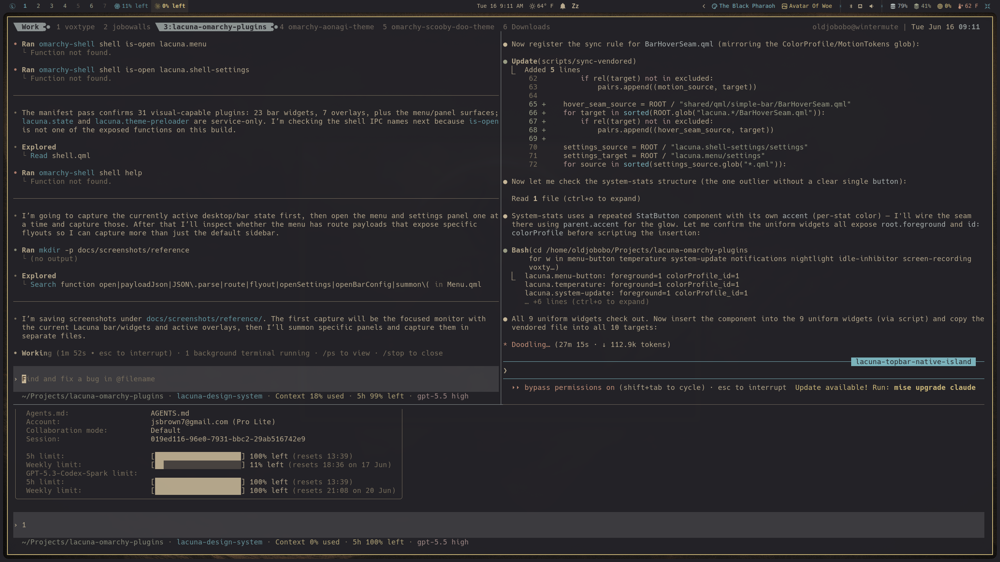

# Lacuna for Omarchy

Lacuna is a cohesive desktop layer for Omarchy: a custom bar and frame,
attached sidebar, focused system flyouts, expressive widgets, and optional
desktop ambience—all running inside Omarchy's existing shell.

It is designed for people who want a desktop with a distinct visual identity
without giving up Omarchy's plugin system, settings, services, or recovery
tools.



## What You Get

- A Lacuna-owned bar and full-screen frame with deliberate seam and connector
  geometry.
- A persistent sidebar for launching apps, controlling media, and reaching
  Lacuna and Omarchy settings.
- Integrated audio, network, Bluetooth, power, notifications, tray, weather,
  workspace, clock, and system-status widgets.
- Theme and wallpaper controls that follow the active Omarchy palette.
- Optional desktop treatments including a large adaptive clock and ambience
  overlays.
- Transactional install, update, rollback, and uninstall workflows that
  preserve your current shell configuration before making changes.

Lacuna stays inside Omarchy's single Quickshell process. It does not launch a
second shell alongside your desktop.

## Install

Clone the repository, enter it, and launch the guided installer:

```bash
git clone https://github.com/OldJobobo/lacuna-omarchy-plugins.git ~/lacuna
cd ~/lacuna
./scripts/lacuna
```

The installer also works from a downloaded and extracted repository archive;
run `./scripts/lacuna` from the extracted directory.

Choose **Full Lacuna install** for the complete experience. The installer
stages the plugins, selects the Lacuna bar, applies its recommended layout,
rescans plugins, and reloads the shell.

Preview the same operation without changing your system:

```bash
./scripts/lacuna install --profile full --dry-run
```

For smaller setups, install only the core shell or the Lacuna replacements for
Omarchy's native bar widgets:

```bash
./scripts/lacuna install --profile core
./scripts/lacuna install --profile native --activate
```

See [Install and update](docs/install.md) for custom plugin selection, manual
Omarchy source installation, updates, rollback behavior, and uninstalling.

## Make It Yours

Lacuna supports two complementary configuration surfaces:

- Omarchy Settings controls bar placement and per-widget options stored in
  `~/.config/omarchy/shell.json`.
- Lacuna settings control the frame, sidebar, color profile, preferred apps,
  quick launchers, and other Lacuna-owned behavior stored in
  `~/.config/omarchy/lacuna/settings.json`.

Use the `semantic` color profile for a restrained foreground-led bar or
`colorful` to let widgets draw more actively from the current Omarchy theme.
Read [Configuration](docs/configuration.md) for the full settings model.

## Pick Your Experience

- **Full:** the custom bar, frame, sidebar, Lacuna widgets, theme workflow, and
  optional visual surfaces.
- **Core:** the Lacuna bar, frame, sidebar, state, and settings foundation.
- **Native replacements:** Lacuna-styled alternatives for common Omarchy bar
  widgets without requiring the full desktop composition.
- **A la carte:** standalone widgets and overlays such as Clock, Weather,
  Workspaces, Codex Usage, Claude Usage, Desktop Clock, and Rainfall.

Browse the [plugin catalog](docs/plugins/README.md) for the available surfaces
and their install boundaries.

## Safety And Recovery

Before an install or update, Lacuna snapshots the active Omarchy shell and
Lacuna state. Plugins are staged through temporary directories and verified
before the operation is accepted. If validation, rescan, or activation fails,
the previous plugin copies and shell configuration are restored.

Return to Omarchy's stock bar at any time with:

```bash
omarchy plugin bar reset
```

## Project Status

Lacuna is currently at version `0.1.0` and is being prepared for its first
Quattro beta. The core shell is usable now, while compatibility, accessibility,
packaging, and release validation continue to be hardened.

Follow the [project roadmap](docs/roadmap.md) for current priorities. Plans and
historical design records live in the [planning ledger](docs/plans/README.md).

## For Contributors

The repository uses one top-level `lacuna.*` directory per Omarchy plugin so
Omarchy can install directly from the source. Run the complete local validation
before publishing changes:

```bash
./scripts/check.sh
```

Start with the [documentation map](docs/README.md),
[design-system entry point](DESIGN.md),
[architecture overview](docs/architecture/overview.md), and
[testing guide](docs/development/testing.md).

## License

Lacuna is released under the [MIT License](LICENSE).
