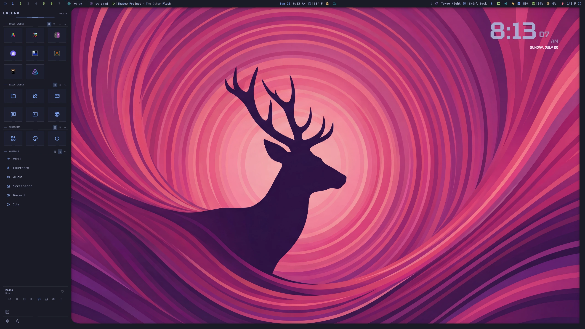
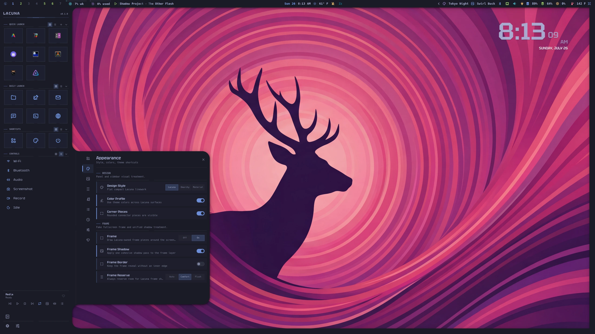
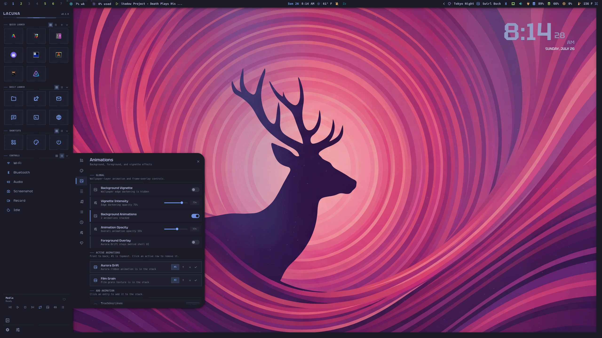

# Lacuna for Omarchy

A complete visual shell for Omarchy: a custom bar and frame, an attached utility
sidebar, focused system controls, expressive widgets, and optional desktop
ambience—all inside the Omarchy shell you already use.



> [!IMPORTANT]
> Lacuna is prerelease software preparing for `0.1.0-beta.1`. The current build
> is usable and transactionally installed, but expect changes before the stable
> `0.1.0` release.

## What Lacuna Changes

Lacuna gives Omarchy a distinct, connected desktop without replacing its plugin
system or starting a second shell.

- A Lacuna bar, full-screen frame, and attached sidebar designed as one surface.
- Quick access to apps, media, audio, network, Bluetooth, power,
  notifications, weather, workspaces, and system actions.
- Theme and wallpaper controls that follow the active Omarchy palette.
- Configurable desktop clock, frame, sidebar, color profiles, and launchers.
- Optional ordered ambience effects such as film grain, rainfall, aurora,
  tracking lines, CRT, and VHS treatments.
- Transactional install, update, rollback, and uninstall workflows that protect
  your existing Omarchy configuration.

<table>
  <tr>
    <td></td>
    <td></td>
  </tr>
  <tr>
    <td align="center"><strong>Appearance and frame controls</strong></td>
    <td align="center"><strong>Ordered desktop ambience</strong></td>
  </tr>
</table>

## Requirements

- A working, up-to-date [Omarchy](https://omarchy.org/) installation.
- Git for installing from this repository.
- ImageMagick is optional; the desktop clock uses it for adaptive wallpaper
  contrast and falls back to theme colors when it is unavailable.

The current beta candidate is reviewed against Omarchy
`4.0.0.r1438.g9b693cc-1` and Quickshell `0.3.0.r18.g10b439f-3`. See the
[compatibility ledger](docs/architecture/quattro-compatibility.md) for the
latest validated host versions.

## Omakase Setup

The normal installation is one checked omakase experience. It installs all 46
supported plugin roots—including experimental surfaces and both media
plugins—while excluding the deprecated migration-only `lacuna.compact-pill`.
It activates the Lacuna bar and applicable menu, service, and overlay entries,
but places only the curated widgets in the canonical bar layout. Media is ready
by default and degrades to unavailable/disabled providers when credentials are
not configured.

Advanced selective profiles and a-la-carte installs remain available for
development, recovery, and manual customization. Browse the
[plugin catalog](docs/plugins/README.md) for the complete list.

## Install

Clone the repository and start the guided installer:

```bash
git clone https://github.com/OldJobobo/lacuna-omarchy-plugins.git "$HOME/lacuna"
cd "$HOME/lacuna"
./scripts/lacuna
```

Choose **Full Lacuna install** for the canonical omakase setup. The installer
previews its checked plan, snapshots your current shell and Lacuna state,
stages and verifies the plugins, applies the canonical layout, and reloads the
Omarchy shell.

To inspect the normal installation without changing anything:

```bash
./scripts/lacuna install --dry-run
```

Scripted installs are also available:

```bash
./scripts/lacuna install --profile full
./scripts/lacuna install --profile core
./scripts/lacuna install --profile ambience --activate
```

See [Install and update](docs/install.md) for custom selection, manual source
installation, package behavior, and advanced recovery details.

## After Installation

The shell reloads into the Lacuna layout when installation finishes.

- Use the sidebar for launchers, controls, media, and system actions.
- Open the gear control at the bottom of the sidebar for Lacuna appearance,
  layout, application, media, and ambience settings.
- Use **Omarchy Settings** for bar placement and individual widget options.
- Continue changing themes and wallpapers through Omarchy; Lacuna follows the
  active palette automatically.

Lacuna settings are stored separately from Omarchy's shell layout, so normal
Omarchy tooling remains available. Read [Configuration](docs/configuration.md)
for the complete settings model.

## Make It Yours

Start with the two color profiles:

- **Semantic** keeps the bar restrained and foreground-led.
- **Colorful** lets widgets draw more actively from the current theme.

From Lacuna Settings you can also:

- turn the frame, shadow, and border treatments on or off;
- choose which monitor owns the sidebar;
- change quick-launch and preferred applications;
- configure the desktop clock;
- enable, tune, and reorder ambience effects;
- switch between full, compact, and theme-provided bar sizing.

## Update

From the cloned repository:

```bash
cd "$HOME/lacuna"
git pull --ff-only
./scripts/lacuna update --yes
```

Preview an update first with `./scripts/lacuna update --dry-run`. Updates are
transactional: if verification or shell reload fails, the touched plugin copies
and shell configuration are restored.

## Reset, Uninstall, And Recovery

Safely restore canonical Lacuna activation, bar layout, and approved
presentation/runtime settings without replacing plugin copies or deleting
credentials, provider configuration, favorites, queue/history, auth files,
reminders, preferred/custom apps, unrelated Omarchy entries, or unknown JSON
fields:

```bash
./scripts/lacuna reset --dry-run
./scripts/lacuna reset
```

Reset has no purge mode. Remove all Lacuna plugins while retaining your Lacuna
preferences:

```bash
./scripts/lacuna uninstall --all
```

Add `--purge-state` only when you also want to delete Lacuna's saved settings.
Return to Omarchy's stock bar at any time with:

```bash
omarchy plugin bar reset
```

For a quick health report or shell restart:

```bash
./scripts/lacuna status
omarchy restart shell
```

See [Troubleshooting](docs/development/troubleshooting.md) when a plugin does not
appear or a runtime action fails.

## Project Status

Lacuna is preparing for its first public beta. Repository checks, live
multi-monitor validation, rollback behavior, and release packaging are actively
maintained. Approved beta, RC, and stable releases are published through GitHub
and the `lacuna-omarchy-plugins` AUR package.

Follow the [roadmap](docs/roadmap.md) for current priorities. Historical design
and implementation records live in the [planning ledger](docs/plans/README.md).

## Contributing

The repository keeps each Omarchy plugin in its own top-level `lacuna.*`
directory. Before publishing a change, run:

```bash
./scripts/check.sh
```

Start with the [documentation map](docs/README.md),
[design-system entry point](DESIGN.md),
[architecture overview](docs/architecture/overview.md), and
[testing guide](docs/development/testing.md).

## License

Lacuna is released under the [MIT License](LICENSE).
